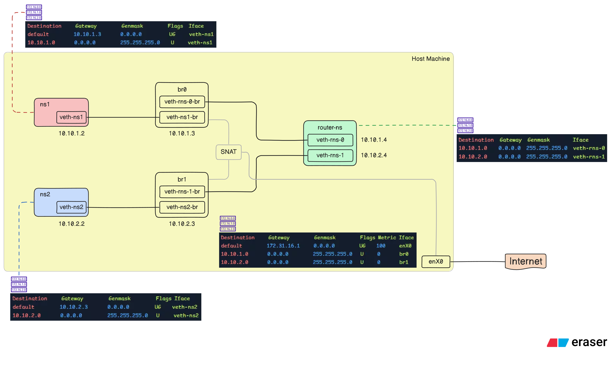

## Objective

Create a network simulation with two separate networks connected via a router using Linux network namespaces and bridges.

## Network Diagram



## How to use it?

1. Run `sudo make build` to build the architecture.
2. Run `sudo make test` to test the network connection.
3. Run `sudo make clean` to run the cleanup script.

Here is the tcpdump log captured after executing the test command for the first time. Tcpdump was run on the host machine, monitoring all interfaces using the "any" option.

```
07:16:57.094720 veth-ns1-br B   ARP, Request who-has 10.10.1.3 tell 10.10.1.2, length 28
07:16:57.094728 veth-rns-0-br Out ARP, Request who-has 10.10.1.3 tell 10.10.1.2, length 28
07:16:57.094720 br0   B   ARP, Request who-has 10.10.1.3 tell 10.10.1.2, length 28
07:16:57.094738 br0   Out ARP, Reply 10.10.1.3 is-at 2e:e8:b7:8b:38:ab, length 28
07:16:57.094751 veth-ns1-br Out ARP, Reply 10.10.1.3 is-at 2e:e8:b7:8b:38:ab, length 28
07:16:57.094755 veth-ns1-br P   IP 10.10.1.2 > 10.10.2.2: ICMP echo request, id 6672, seq 1, length 64
07:16:57.094755 br0   In  IP 10.10.1.2 > 10.10.2.2: ICMP echo request, id 6672, seq 1, length 64
07:16:57.094772 br1   Out ARP, Request who-has 10.10.2.2 tell 10.10.2.3, length 28
07:16:57.094773 veth-rns-1-br Out ARP, Request who-has 10.10.2.2 tell 10.10.2.3, length 28
07:16:57.094776 veth-ns2-br Out ARP, Request who-has 10.10.2.2 tell 10.10.2.3, length 28
07:16:57.094782 veth-ns2-br P   ARP, Reply 10.10.2.2 is-at da:66:1e:47:48:b8, length 28
07:16:57.094782 br1   In  ARP, Reply 10.10.2.2 is-at da:66:1e:47:48:b8, length 28
07:16:57.094784 br1   Out IP 10.10.2.3 > 10.10.2.2: ICMP echo request, id 6672, seq 1, length 64
07:16:57.094784 veth-ns2-br Out IP 10.10.2.3 > 10.10.2.2: ICMP echo request, id 6672, seq 1, length 64
07:16:57.094791 veth-ns2-br P   IP 10.10.2.2 > 10.10.2.3: ICMP echo reply, id 6672, seq 1, length 64
07:16:57.094791 br1   In  IP 10.10.2.2 > 10.10.2.3: ICMP echo reply, id 6672, seq 1, length 64
07:16:57.094794 br0   Out IP 10.10.2.2 > 10.10.1.2: ICMP echo reply, id 6672, seq 1, length 64
07:16:57.094794 veth-ns1-br Out IP 10.10.2.2 > 10.10.1.2: ICMP echo reply, id 6672, seq 1, length 64
07:16:57.101938 veth-ns2-br P   IP 10.10.2.2 > 10.10.1.2: ICMP echo request, id 6677, seq 1, length 64
07:16:57.101938 br1   In  IP 10.10.2.2 > 10.10.1.2: ICMP echo request, id 6677, seq 1, length 64
07:16:57.101957 br0   Out IP 10.10.1.3 > 10.10.1.2: ICMP echo request, id 6677, seq 1, length 64
07:16:57.101959 veth-ns1-br Out IP 10.10.1.3 > 10.10.1.2: ICMP echo request, id 6677, seq 1, length 64
07:16:57.101965 veth-ns1-br P   IP 10.10.1.2 > 10.10.1.3: ICMP echo reply, id 6677, seq 1, length 64
07:16:57.101965 br0   In  IP 10.10.1.2 > 10.10.1.3: ICMP echo reply, id 6677, seq 1, length 64
07:16:57.101968 br1   Out IP 10.10.1.2 > 10.10.2.2: ICMP echo reply, id 6677, seq 1, length 64
07:16:57.101969 veth-ns2-br Out IP 10.10.1.2 > 10.10.2.2: ICMP echo reply, id 6677, seq 1, length 64
07:16:57.107908 veth-ns1-br P   IP 10.10.1.2 > 1.1.1.1: ICMP echo request, id 6682, seq 1, length 64
07:16:57.107908 br0   In  IP 10.10.1.2 > 1.1.1.1: ICMP echo request, id 6682, seq 1, length 64
07:16:57.107926 enX0  Out IP 172.31.28.46 > 1.1.1.1: ICMP echo request, id 6682, seq 1, length 64
07:16:57.109312 enX0  In  IP 1.1.1.1 > 172.31.28.46: ICMP echo reply, id 6682, seq 1, length 64
07:16:57.109320 br0   Out IP 1.1.1.1 > 10.10.1.2: ICMP echo reply, id 6682, seq 1, length 64
07:16:57.109323 veth-ns1-br Out IP 1.1.1.1 > 10.10.1.2: ICMP echo reply, id 6682, seq 1, length 64
07:16:57.114016 veth-ns2-br P   IP 10.10.2.2 > 1.1.1.1: ICMP echo request, id 6687, seq 1, length 64
07:16:57.114016 br1   In  IP 10.10.2.2 > 1.1.1.1: ICMP echo request, id 6687, seq 1, length 64
07:16:57.114030 enX0  Out IP 172.31.28.46 > 1.1.1.1: ICMP echo request, id 6687, seq 1, length 64
07:16:57.115020 enX0  In  IP 1.1.1.1 > 172.31.28.46: ICMP echo reply, id 6687, seq 1, length 64
07:16:57.115025 br1   Out IP 1.1.1.1 > 10.10.2.2: ICMP echo reply, id 6687, seq 1, length 64
07:16:57.115027 veth-ns2-br Out IP 1.1.1.1 > 10.10.2.2: ICMP echo reply, id 6687, seq 1, length 64
```

> I've also implemented bash script named `script.sh` to do the same task.
